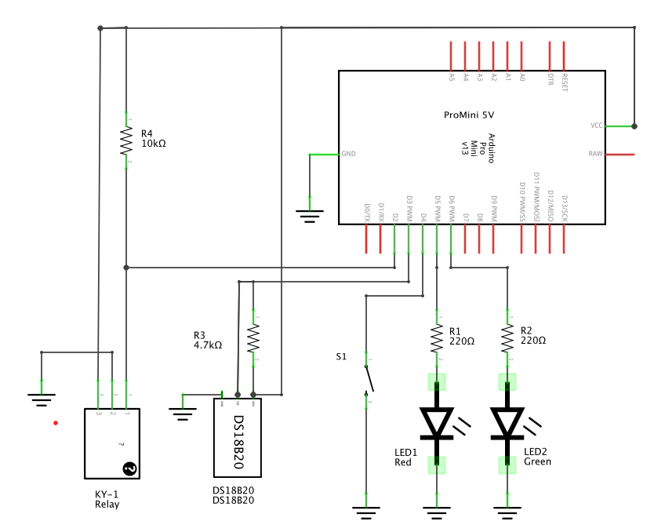
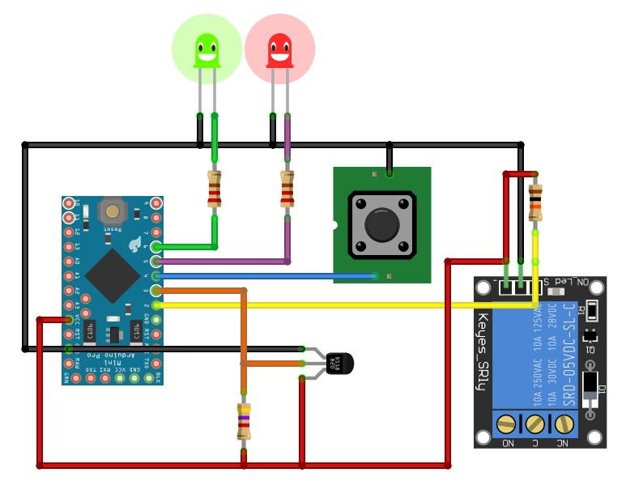

# MySensors (Monitors) Relay

## Introduction

I've two screens attached to my main computer. I prefer to put it to sleep rather than shut it down every day , so I have to shutdown both screens everey evening, and turn them up every morning. As I am lazy, I've designed this node, to be able to either manually turn them on/off, or better, to automatically turn them off/on whenever the computer goes to sleep or wake up.

As always when adding a node into a room, I've' also integrated a sensor to report the romm's temperature, instead of building a separate one.

## Features

This [MySensors](https://www.mysensors.org/)  node provides the following features :

- Controls a Device state (On/Off) using a Relay
- Switch the Device state via Radio (MySensors)
- Toggle the Device state using a single push button
- Feedback the device state using 2 leds (Green and Red)
- also reports Room temperature every minutes
- reovers the last state when powering up
- blinks the green led while sending the temperature
- blinks the red led while receiving a rely command

## Script to trigger Switching the node upon Computer Sleep / WakeUp

On the Mac, I'm using the [SleepWatcher](http://www.bernhard-baehr.de/) script to trigger a mysensor command, fetching an 'action' URL from [phpMydomo](http://www.phpmydomo.org/doc?a=mysensors), whenever the Mac is going to sleep or to wakeUp. The 2 triggered scripts are as simple as:

**on WakeUp :**

`wget http://IP_OF_MY_PHPMYDOMO/action?type=mysensors&preset=monitors_on`

**on Sleep :**

`wget http://IP_OF_MY_PHPMYDOMO/action?type=mysensors&preset=monitors_off`

*You would certainly find a equivalent solution on windows on Windows or Linux to trigger a script upon Sleep/WakeUp.*

## Schematic and Wiring

For simplicity, the radio module wiring is not described there. Please refer to this [MySensors Page](https://www.mysensors.org/build/connect_radio) to learn how to  conect the radio module.

